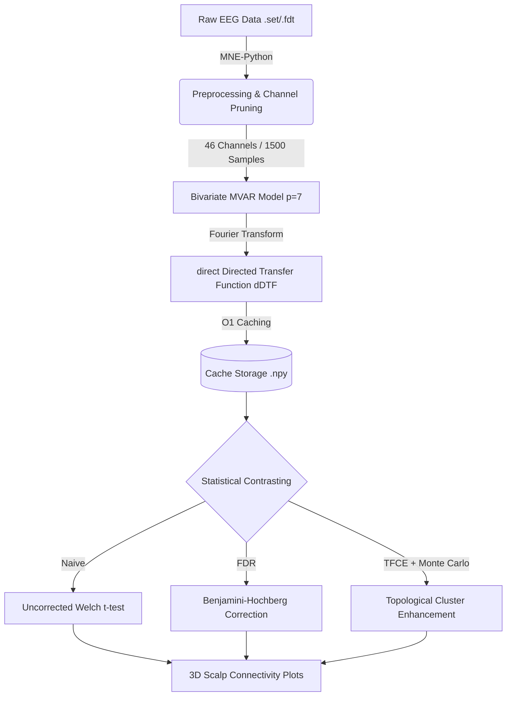
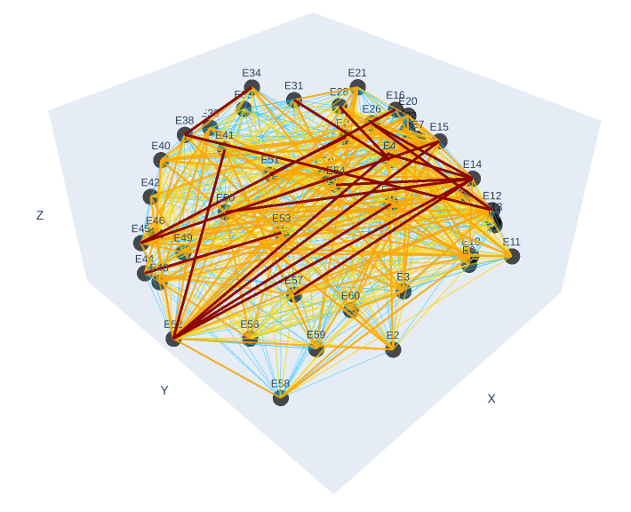
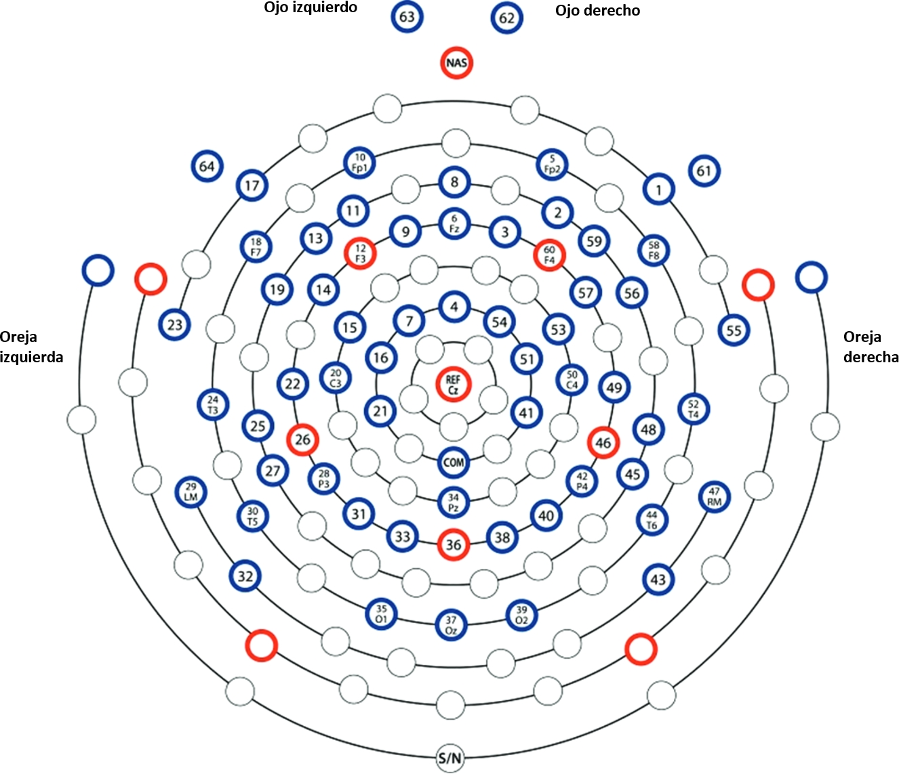

# EEG Functional Connectivity Pipeline: dDTF & TFCE


This repository records my advancements while following an undergraduate research program **(IPre)**, under the supervision of Professor Mircea Petrache (Faculty of Mathematics - PUC) and Professor Marcela Peña (School of Psychology - PUC). The main goal is to analyze functional connectivity in EEG data using direct Directed Transfer Function (dDTF) and evaluate statistical significance via Threshold-Free Cluster Enhancement (TFCE).

## Pipeline Architecture



## How to Run

The pipeline is fully automated and designed for HPC environments. Execution is handled via the `run_pipeline.py` orchestrator.

### Basic Execution
Run all statistical methods (Naive, FDR, and TFCE) with default parameters:
```bash
python run_pipeline.py
```

### Command-Line Arguments (`argparse`)
You can fully customize the execution using the following flags:

* `--method`: Choose the statistical approach to run. Options: `naive`, `fdr`, `tfce`, or `all`. *(Default: `all`)*
* `--p`: Optimal MVAR model lag order. *(Default: `7`)*
* `--R`: Spatial radius (in cm) for topological clustering in TFCE. Controls node adjacency. *(Default: `6.44`)*
* `--dh`: Discrete step size for the TFCE Riemann integral. *(Default: `0.1`)*
* `--perms`: Number of Monte Carlo permutations for the TFCE empirical null distribution. *(Default: `1000`)*
* `--jobs`: Number of CPU cores for parallel permutation processing. Set to `-1` to use all available cores. *(Default: `-1`)*

**Example HPC run:**
```bash
python run_pipeline.py --method tfce --R 6.44 --perms 5000 --jobs 16
```

## Adding New Data & Configuration

All global settings and data paths are centralized in the `parameters.py` file. To add new data:

1. **Place your `.set` and `.fdt` files** inside the data directories (`data/epch_heartbeat/` and `data/epch_silence/`).
2. **Update `parameters.py`** if your directory names differ:
   ```python
   HB_DIR = Path("data/your_new_hb_folder")
   SI_DIR = Path("data/your_new_si_folder")
   ```
3. Ensure the spatial coordinates file (`data/eeglab_65chanlocs.elp`) is present, as it is strictly required to calculate spatial distances for the 3D plots and TFCE clustering.
4. Customize dropped channels or frequency bands (`F_BANDS`) directly in `parameters.py` as needed.

## Output Structure
All generated outputs are automatically saved in the `plots/` directory:
- **`p_values_*.npy`**: Raw matrices of the statistical p-values.
- **`.html` files**: Interactive 3D scalp plots of significant connections.
- **`.png` files**: Edge count evolution charts and TFCE energy heatmaps.

## Figures
<br>
<div align="center">
  
  <p>
    <br>
    <em><b>Figure 1:</b> Temporal evolution of directed functional connectivity (dDTF) within the <b>Alpha</b> frequency band under an uncorrected univariate significance contrast (<b>Naive approach</b>, Welch's t-test at a threshold of p < 0.05). The animation illustrates the volume of surviving directed edges across the scalp topography over consecutive experimental epochs.</em>
  </p>
</div>
<br>
<div align="center">
  
  <p>
    <br>
    <em><b>Figure 2:</b> Map of channels. </em>
  </p>
</div>
