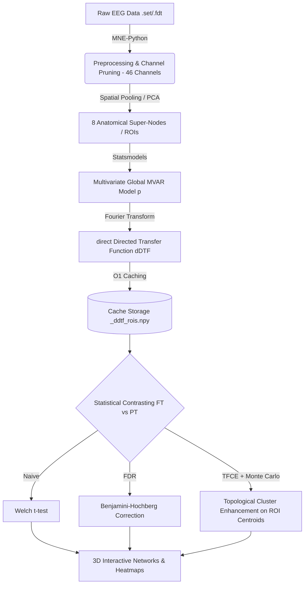

# EEG Functional Connectivity Pipeline: dDTF & TFCE


This repository documents my undergraduate research project **(IPre)** conducted during the first semester of 2026 under the supervision of Professor Mircea Petrache (Faculty of Mathematics - PUC) and Professor Marcela Peña (School of Psychology - PUC). The main goal is to analyze functional connectivity in EEG data using direct Directed Transfer Function (dDTF) and evaluate statistical significance via Threshold-Free Cluster Enhancement (TFCE).

## Pipeline Architecture (Super-Nodos / ROIs)



## Model Order Selection (AIC & BIC)

Para evitar fijar el orden del rezago $p$ arbitrariamente, dispones de una herramienta reproducible y modularizada para calcular los criterios de información de Akaike (AIC) y Bayesiano (BIC) sobre las épocas multivariadas de super-nodos:

```bash
# Evaluar orden óptimo p en todo el dataset y generar curvas en plots/
python find_optimal_p.py --max-p 15 --method mean
```

Esto generará `plots/mvar_order_selection_curves.png` (curvas de AIC/BIC y distribución de votos por época) y el archivo de métricas estructurado `plots/mvar_order_selection.json`.

## How to Run

El pipeline está completamente automatizado y preparado para entornos HPC / Slurm. La ejecución se gestiona mediante el orquestador `run_pipeline.py`.

### Basic Execution
Ejecutar todos los métodos estadísticos (Naive, FDR y TFCE) sobre super-nodos (ROIs):
```bash
python run_pipeline.py
```

### Command-Line Arguments (`argparse`)
Puedes personalizar la ejecución con las siguientes banderas:

* `--use-rois`: Opera sobre los 8 super-nodos ROIs anatómicamente definidos. *(Habilitado por defecto)*
* `--no-rois`: Desactiva el modo ROIs y ejecuta el análisis canal a canal bivariado legado.
* `--roi-method`: Método de agregación de canales dentro de cada ROI: `mean` (promedio espacial) o `pca` (primer componente principal). *(Default: `mean`)*
* `--select-order`: Ejecuta la búsqueda empírica de orden MVAR vía AIC/BIC antes de iniciar el cálculo de conectividad.
* `--method`: Método estadístico a correr: `naive`, `fdr`, `tfce`, o `all`. *(Default: `all`)*
* `--p`: Orden del modelo MVAR. *(Default: el fijado en `parameters.P_OPTIMO`)*
* `--R`: Radio espacial (en cm) para adyacencia espacial en TFCE. *(Default: automático, 9.5 cm para ROIs)*
* `--dh`: Paso discreto para la integral de Riemann en TFCE. *(Default: `0.1`)*
* `--perms`: Número de permutaciones Monte Carlo para TFCE. *(Default: `1000`)*
* `--jobs`: Número de cores CPU para paralelización (-1 = todos). *(Default: `-1`)*

**Ejemplo HPC run:**
```bash
python run_pipeline.py --method all --use-rois --perms 5000 --jobs 16
```

## Adding New Data & Configuration

All global settings and data paths are centralized in the `parameters.py` file. To add new data:

1. **Place your `.set` and `.fdt` files** inside the data directories (`data/epch_heartbeat/` and `data/epch_silence/`).
2. **Update `parameters.py`** if your directory names differ:
   ```python
   HB_DIR = Path("data/your_new_hb_folder")
   SI_DIR = Path("data/your_new_si_folder")
   ```
3. Ensure the spatial coordinates file (`data/eeglab_65chanlocs.elp`) is present, as it is strictly required to calculate spatial distances for the 3D plots and TFCE clustering.
4. Customize dropped channels or frequency bands (`F_BANDS`) directly in `parameters.py` as needed.

## Output Structure
All generated outputs are automatically saved in the `plots/` directory:
- **`p_values_*.npy`**: Raw matrices of the statistical p-values.
- **`.html` files**: Interactive 3D scalp plots of significant connections.
- **`.png` files**: Edge count evolution charts and TFCE energy heatmaps.

## Figures
<br>
<div align="center">
  
  <p>
    <br>
    <em><b>Figure 1:</b> Temporal evolution of directed functional connectivity (dDTF) within the <b>Alpha</b> frequency band under an uncorrected univariate significance contrast (<b>Naive approach</b>, Welch's t-test at a threshold of p < 0.05). The animation illustrates the volume of surviving directed edges across the scalp topography over consecutive experimental epochs.</em>
  </p>
</div>
<br>
<div align="center">
  
  <p>
    <br>
    <em><b>Figure 2:</b> Map of channels. </em>
  </p>
</div>
